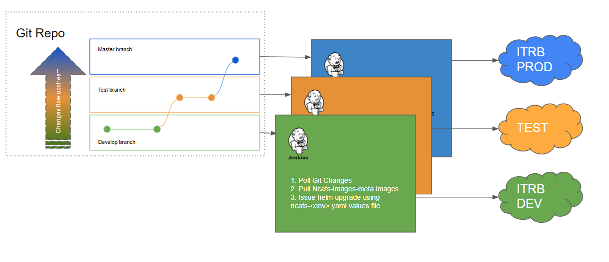

# ITRB Deployment Strategy

### Introduction 

NCATS ITRB provisions three deployment environment. Production, test and development. This repository has been setup in such 
a way that the three deployment environments are mirrored and controlled on the three branches Master, test and develop respectively. 
Deployments are automated via Jenkins files that are run by Jenkins agents for each environment. Management of those Jenkins instances is 
out of the scope of this repository. 

#### Triggers

Deployments are triggered by SCM poll run by the Jenkins agents for each environment, detecting changes in the respective branches. Polling 
occurs every half hour. 

For eg. if we push changes to  `helm/answer-coalesce` files, Jenkins for ITRB development environment (configured via [./jenkins/answer-coalesce](./jenkins/answer-coalesce/Jenkinsfile)) will start the deployment process.

> **Note** This configuration is for deployment to CI ITRB enviroment. For Test and Production enviroments , a request needs to be made to ITRB for deploying the changes. 

### Deployment Process in Jenkins

---

##### Case 1 : Image Updates 

For easier image management, image versions are maintained via `ncats-images-meta.yaml` files in each `helm/*` charts (eg. [`helm/answer-coalesce/ncats-images-meta.yaml`](./helm/answer-coalesce/ncats-images-meta.yaml)). 
These files are parsed in the Jenkins pipelines. After Parsing the image versions specified are pulled into ITRB's managed image registry.

After Pulling images the pipeline would use the matching ncats-<env>-values.yaml (eg. [`helm/answer-coalesce/ncats-dev-values.yaml`](./helm/answer-coalesce/ncats-dev-values.yaml))
would be re-populated with the images from the private repo to generate a new values file. 

Using the newly generate values file, Jenkins then issues helm upgrade on the release, hence upgrading the chart. 

##### Case 2: Chart Updates

There might be cases where chart template files are updated on a branch. Or for that matter change in a value in one of the values files. 
In such cases, the output of helm upgrade would patch parts of the chart that need upgrade. The Jenkins pipeline would still run the process
mentioned in `Case 1` . And the effect would be any resources needing redeployment would be affected as they would by helm upgrade. 

